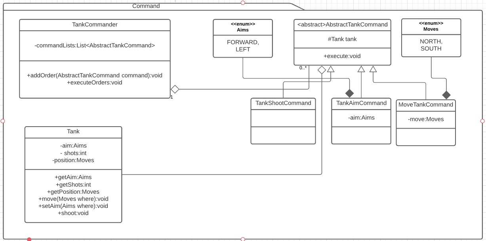

# Command
Es un patron de comportamiento (behavioral). [Link descripcion](https://sourcemaking.com/design_patterns/command)

Desacopla la llamada de métodos en un receiver desde el invoker ocultando las llamadas a través de un método execute. Ademas estos objetos command pueden encolarse para generar una llamada ordenada e incluso ganar la habilidad de deshacer los comandos ejecutados.

## Diagrama de clases

## SOLID
* Single responsibility

El patron command genera comandos con una sola responsabilidad (ejecutar una acción sobre el objeto tank, en este caso) y el commander tiene una sola responsabilidad (encolar y ejecutar toda la lista de comandos) por lo que este principio se cumple.

* Open/Close principle

El abstract command puede tener una implementación mínima o ser directamente una interfaz, cada command tiene una tarea especifica por lo que si se necesita agregar funcionalidad es muy facil implementar comandos nuevos. Este principio se cumple.

* Liskov substitution

No hay razón para que un comando no pueda ejecutarse como si fuera el padre, de hecho en este ejemplo todos los comandos se ejecutan como si fueran el AbstractTankCommand, por lo que este principio se cumple

* Interface segregation

El hecho de que cada comando sea lo más atomico posible ayuda a que se cumpla este principio

* Dependency inversion

En este ejemplo el commander solo conoce la interfaz abstracta y no las implementaciones concretas, la única dependencia la tenemos en los comandos que conocen la clase concreta tank, pero podría perfectamente ser una interfaz y quedar completamente desacoplado. Este principio se podría cumplir (aunque creo que al depender de la clase concreta Tank en AbstractTankCommand lo estoy rompiendo)
